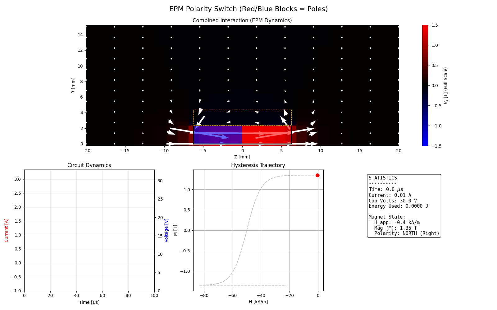
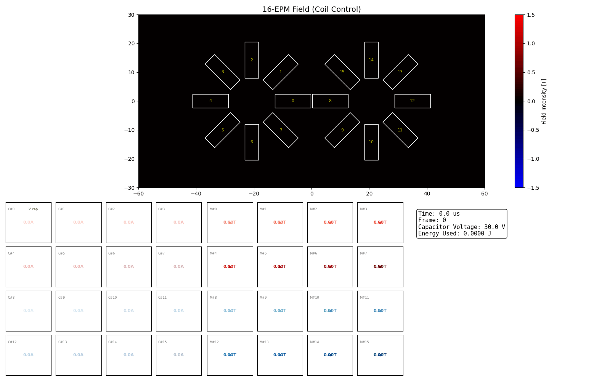
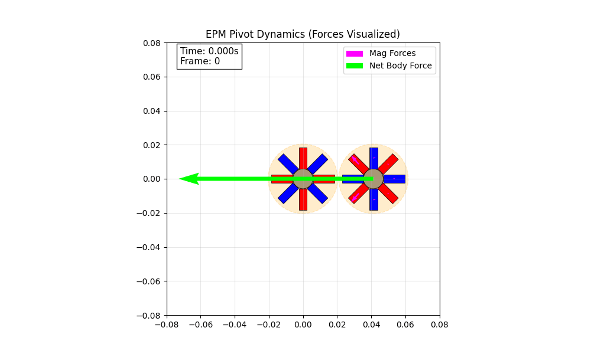
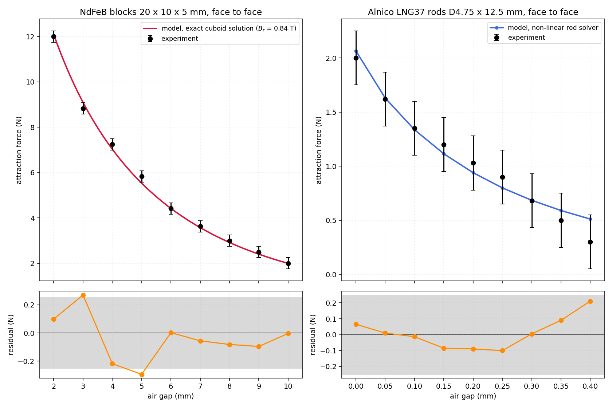

# Mohamed Waiel Shikfa Simulation work for the SCS Senior Thesis at CMUQ

Quick screenshot of what to expect:

## Clamping-force model

`simulations/Force_compute/python/magnet_force.py` is the force engine that
reproduces the measurements in `simulations/Force_compute/Mag Force Data.csv`.
Run `python validate_vs_experiment.py` in that folder to regenerate the
comparison below (`--refit` re-runs the calibration, `python magnet_force.py`
runs the engine's self-tests).

| dataset | RMS error | max residual | measurement uncertainty |
|---|---|---|---|
| NdFeB blocks, 2-10 mm | 0.16 N | 0.29 N | ±0.25 N |
| Alnico rods, 0-0.4 mm | 0.10 N | 0.21 N | ±0.25 N |

### Method

Two solvers, both built from the same pair of Lipschitz-Hankel kernels:

* **Cuboids** - the closed-form solution of Akoun & Yonnet (1984). Exact for a
  material with a straight recoil line, which is what NdFeB is. Verified here
  against a brute-force surface-charge integration (agreement to 5 decimal
  places) and against the point-dipole limit.
* **Coaxial cylinders** - a magnetisation integral equation. Each rod is split
  into axial slabs and the polarisation of every slab is solved
  self-consistently against the material's second-quadrant curve, with recoil
  lines and irreversible-loss history. Verified against published magnetometric
  demagnetising factors, the Maxwell contact limit and the dipole limit.

Neither solver contains a fitted geometric factor. Only two numbers are
calibrated against the data: the NdFeB remanence (the grade is unknown) and the
Alnico loss per pull-off.

### What the old models got wrong

* The lumped-permeance scripts (`magnet_sim.py`, `magnet_sim_alnico.py`,
  `magnet_sim_NIB.py`) use Roters fringing formulae plus hand-tuned blending
  weights and a `/2` "shared field" factor. Those are corrections for a
  1-D magnetic circuit and cannot represent the fringing between two magnets in
  free air; they are off by factors of 2-5.
* `dimension_analysis.py` and `magnet_sim_diapol_NIB.py` use a point-dipole
  force, which underestimates by more than 4x at the gaps that were measured.
* **Alnico is not a fixed-magnetisation problem.** LNG37 has Hcj = 49 kA/m, so a
  D4.75 x 12.5 mm rod (demagnetising factor 0.144) sits *below the knee* of its
  own demagnetisation curve as soon as it is open-circuited: the volume-average
  polarisation collapses from Br = 1.20 T to about 0.47 T, and it does not
  recover. That single effect accounts for the factor of ~5 between the naive
  prediction and the measured 2 N. Every earlier attempt missed it.

### Findings about the hardware

* The NdFeB blocks behave like **Br ~ 0.84 T**, roughly 65% of N42. They are
  either bonded NdFeB or sintered blocks that were never fully saturated.
  Testable prediction: the pair should hold **28 N in contact** and 0.9 N at
  15 mm.
* The Alnico rods lose about **1.5-2% of their polarisation on every
  pull-off**. The readings were taken in increasing-gap order, so a
  significant part of the 2.0 N -> 0.3 N drop is the rods weakening rather than
  the gap growing. Re-magnetising them and repeating the sweep in random order
  would separate the two effects. Freshly saturated rods should hold
  **~7.7 N in contact**.

